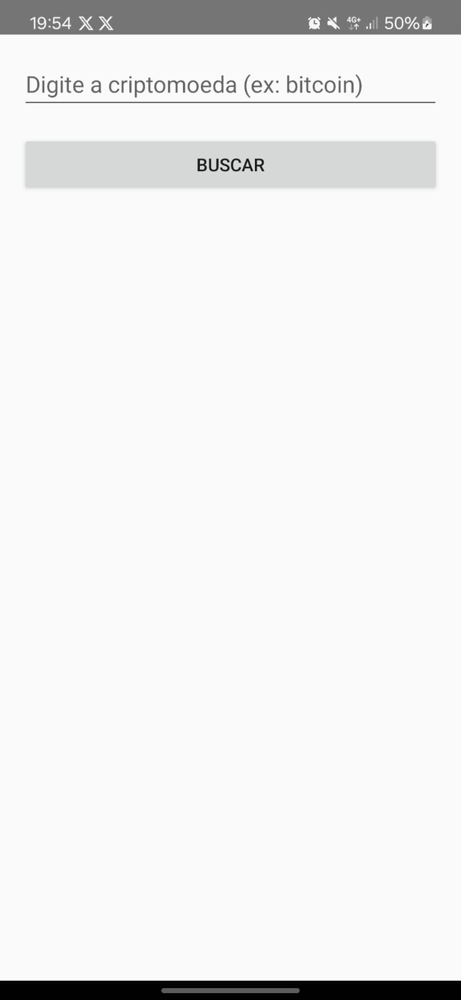
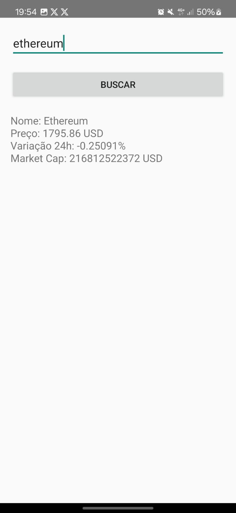

# 📊 Projeto Android: Consulta de Criptomoedas com API

Este projeto faz parte da disciplina **Desenvolvimento para Dispositivos Móveis** no curso de **Análise e Desenvolvimento de Sistemas (6º Período - IFTM)**.  

---

## 🎯 Objetivo

Desenvolver um aplicativo Android que consome uma API pública de criptomoedas e permite ao usuário consultar o preço, variação e capitalização de mercado de moedas como Bitcoin, Ethereum, entre outras, com uma interface simples e funcional em XML.

---

## 🚀 Recursos Implementados

```bash
✔ Campo de busca para inserir o nome da criptomoeda (ex: bitcoin, ethereum)
✔ Botão para realizar a consulta via API
✔ Exibição do nome da moeda, preço atual, variação nas últimas 24h e valor de mercado
✔ Requisições assíncronas utilizando OkHttp
✔ Tratamento de erros e mensagens claras ao usuário
```

---

## 🌐 API Utilizada

```bash
🔹 CoinGecko (gratuita e sem autenticação)
🔹 Endpoint usado:
    https://api.coingecko.com/api/v3/coins/markets?vs_currency=usd&ids=bitcoin
```

---

## 🛠 Tecnologias Utilizadas

```bash
🔧 Kotlin
🔧 Android Studio
🔧 XML (interface)
🔧 OkHttp (requisições HTTP)
🔧 JSON (manipulação de resposta)
```

---

## 📱 Interface do Projeto


 


## 📌 Expectativa do Projeto

```bash
🎯 Estimular o uso de APIs REST em apps Android nativos.
🎯 Praticar consumo e tratamento de dados JSON.
🎯 Trabalhar com boas práticas de interface responsiva em XML.
```

---

> **IFTM - Instituto Federal do Triângulo Mineiro**  
> Disciplina: Desenvolvimento para Dispositivos Móveis  
> 6º Período de ADS – 2025

